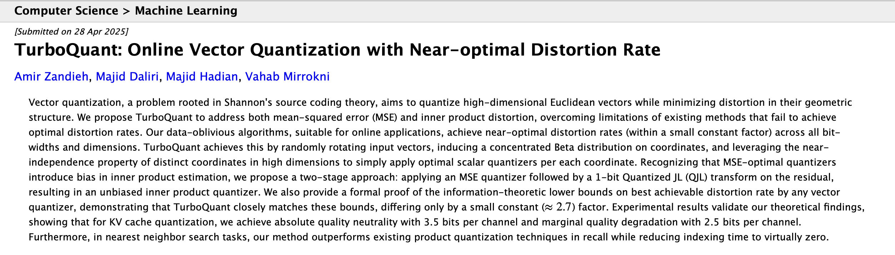

# TurboQuant MLX



This is a learning-focused MLX recreation of [TurboQuant](https://arxiv.org/abs/2504.19874) — a KV cache compression technique that quantizes key vectors using polar coordinates and Lloyd-Max codebooks.

This is meant to be paired with my blog post which covered the theory side in more technical depth, and this is more a showcase how it works when we translate the theory into code. 

---

## Where this sits 
This is a layer 2 implementation (we're using the correct math, real model vectors, and pure python + MLX).
It DOES NOT include custom Metal kernels for fused dequant-matmul (Layer 3). 
For production level use, see [helgklaizar/turboquant_mlx](https://github.com/helgklaizar/turboquant_mlx).

---

## What it does

Runs a forward pass on `Qwen3.5-0.8B` (choose this for the sole reason it's small and should be ran quite easily on most machines) and compares BF16 (because the model uses bf16) vs TurboQuant (after) KV cache representations layer by layer:

- Captures raw K tensors via hooks on `self_attn.k_proj` (by default Qwen doesn't cache the k keys, thus we simply make a hook to capture it and store it to the side)
- Applies polar transformation → Lloyd-Max quantization → sign-correction residual
- Reports attention score error and bytes-per-token compression

**Example output:**
```
TurboQuant MLX — Qwen3.5-0.8B
========================================================
self_attn layers: [3, 7, 11, 15, 19, 23]
prompt : 'The capital of France is'  |  tokens: 5

--- layer-by-layer comparison ---
 layer    true score   turbo score    norm err
-------------------------------------------------------
     3        5.7201        5.6849      0.0352
    23       -1.8833       -0.9566      0.0302
--------------------------------------------------------

norm error — mean: 0.0288  median: 0.0322  max: 0.0592

compression : 3.56x
  BF16      : 1024 bytes / token
  TurboQuant: 288 bytes / token
  self_attn layers: 6
```

> Note: quantized values are not fed back into the model — this is purely a measurement exercise.

---

## Files

| File | Purpose |
|---|---|
| `Turbo quant mlx.py` | Main implementation — run this |
| `Lloyd max mlx.py` | Lloyd-Max codebook derivation (build-up step) |
| `run_model.py` | Basic MLX model runner (build-up step) |
| `main.py` | Entry point / scratch |

---

## Setup

Requires [uv](https://github.com/astral-sh/uv) and an Apple Silicon Mac.

```bash
uv run "Turbo quant mlx.py"
```

Dependencies are declared in `pyproject.toml` and locked in `uv.lock`.
